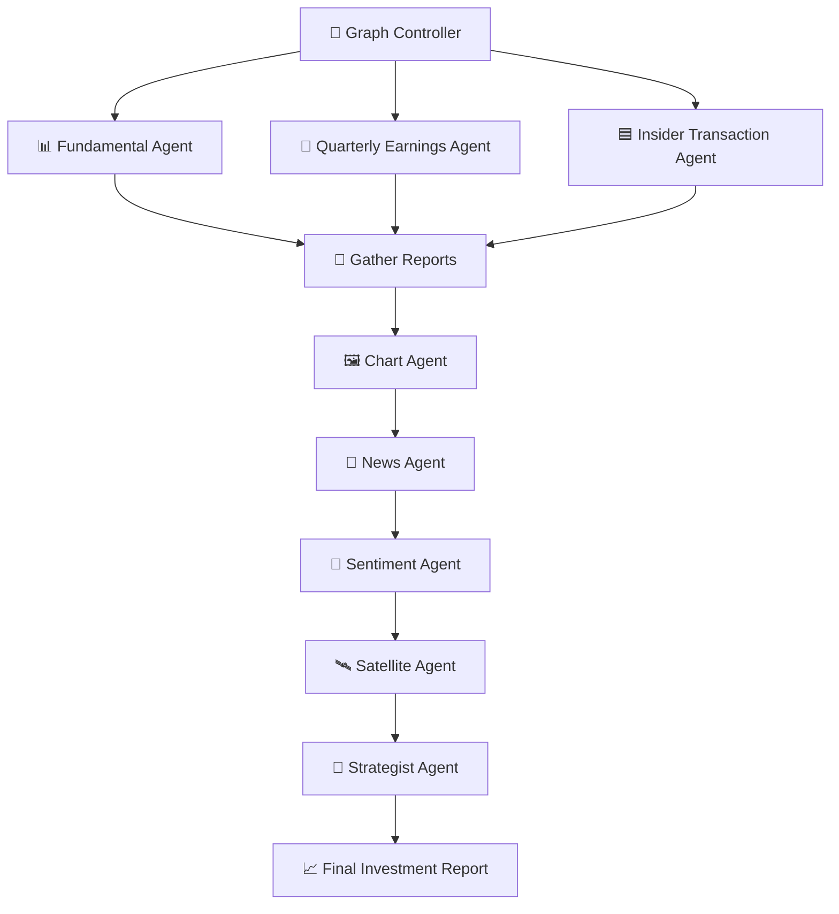

# 📈 HedgeMind AI

🧠 *A multi-agent, multi-modal system that transforms any U.S. stock ticker into a professional-grade investment report — combining fundamentals, earnings, insider trades, charts, news, sentiment, and strategy.

---

## 🚀 Overview

`HedgeMind AI` is a LangGraph-powered multi-agent framework for automated equity research.
It integrates structured financial data, unstructured news & sentiment, and visual analysis (charts/images) into a single end-to-end research pipeline.

Agents operate in layers:

Layer 1: Fetch core signals (fundamentals, quarterly earnings, insider transactions)

Layer 2: Aggregate reports and generate financial charts

Layer 3: Enrich with news, sentiment, and alternative data (satellite, etc.)

Layer 4: Strategist agent synthesizes everything into a final investment thesis

---

## 🔍 What It Does

-📊 **Fundamental Analysis** (P/E, revenue growth, margins, debt, valuation trends)
-🧾 **Quarterly Earnings** (revenue, net income, EPS, QoQ/YoY growth)
-🟦 **Insider Transactions** (timing of executive buys/sells, net flows, value)
-🖼️ **Chart Agent** (price with insider overlays, revenue vs. net income trends, SPY relative performance)
-📰 **News Analysis** (sector context, catalysts, risks)
-🧠 **Sentiment Analysis** (Reddit/WSB hype, trader conviction, retail momentum)
-🛰️ **Satellite / Alt-Data Hooks** (placeholder for supply chain, foot traffic, etc.)
-📈 **Strategist Agent** (final outlook: bullish/bearish, risks, time horizon, catalysts)


---

## 🎯 Example:
```
==========================================================================================
|                             📈 Welcome to HedgeMind AI                                 |
|                                                                                        |
|   A multi-agent, multi-modal research system for U.S. equities.                        |
|   It integrates fundamentals, earnings, insider activity, charts, news, sentiment,     |
|   and strategy to deliver professional-grade investment insights.                      |
==========================================================================================
```
The output includes:

- ✅ 📊 **Fundamental Report**: Highlights valuation concerns (P/E 136x, 0% revenue growth)
- ✅ 🧾 **Quarterly Earnings Report**: Recent revenue, net income, EPS with QoQ/YoY changes
- ✅ 🟦 **Insider Report**: Tracks major insider buys/sells and their timing vs. price peaks
- ✅ 🖼️ **Chart Analysis**: LLM insights from price + insider overlays, revenue vs. profit, SPY relative performance
- ✅ 📰 **News Summary**: Cautiously mixed due to macro weakness and crypto volatility
- ✅ 🧠 **Reddit Sentiment**: Extremely bullish with strong retail conviction and FOMO
- ✅ 🧩 **Strategy Report**: Final outlook flags high risk of short-term correction due to overvaluation + speculative rally

---

## 🧠 Architecture

`HedgeMind AI` uses a multi-layer LangGraph DAG to orchestrate agents:

### 🧬 Execution Flow



### ⚙️ Installation
```
git clone https://github.com/tongxincs/HedgeMindAI.git
cd hedgemind-ai
pip install -r requirements.txt
```

### 🔐 Required API Keys
Before running, create a `.env` file in the project root and insert:
```
# Finnhub
FINNHUB_API_KEY='your_finnhub_key'

# Reddit API
REDDIT_CLIENT_ID='your_reddit_client_id'
REDDIT_CLIENT_SECRET='your_reddit_client_secret'

# Google for LLM
GOOGLE_API_KEY='your_google_api_key'
```

You can get free API keys from:

*   [Finnhub](https://finnhub.io)
*   [Reddit Developer](https://www.reddit.com/prefs/apps?)
*   [Google Cloud Console](https://console.cloud.google.com/apis/)

### 💡 Usage
```
python main.py
```
You’ll be prompted to enter a stock ticker. The multi-agent analysis will begin automatically, showing real-time CLI output from each agent:
```
📊 [Fundamental Agent] Fetching key financials...
🧾 [Quarterly Earnings Agent] Analyzing last 8 quarters...
🟦 [Insider Agent] Processing insider trades...
🖼️ [Chart Agent] Generating charts and running LLM vision analysis...
📰 [News Agent] Pulling sector headlines...
🧠 [Sentiment Agent] Mining Reddit discussion...
🛰️ [Satellite Agent] Integrating alt-data...
🧩 [Strategist Agent] Synthesizing final investment outlook...
```
At the end, a clean, timestamped research report will be printed.

### 🧱 Extensibility
Each agent is a self-contained module, with its own API logic, LLM prompt, and output formatting. The system can be extended with plug-and-play ease — e.g., by adding:

*   🟩 OptionsFlowAgent
*   🟨 MacroIndicatorAgent
*   🟦 ETFExposureAgent
*   🟣 Video/Speech Agent (earnings call audio/video transcripts)

### 📝 License
MIT License. See [LICENSE](./LICENSE) for full details.
