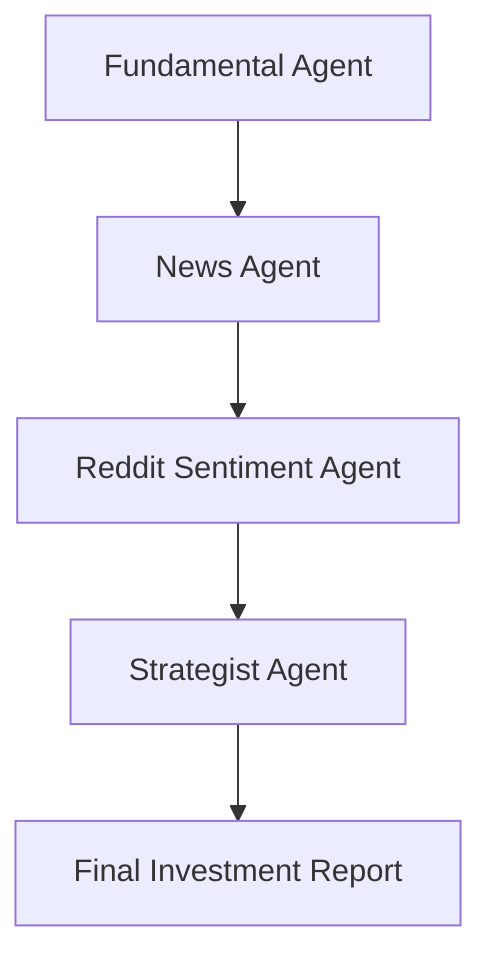

# 📈 StockInsight AI

🧠 *An intelligent multi-agent system that transforms any U.S. stock ticker into a professional-grade investment report within minutes.*

---

## 🚀 Overview

`StockInsight AI` is a LangGraph-powered multi-agent system that performs automated financial analysis on any U.S. stock. It pulls real-time data from public APIs, runs each data stream through dedicated agents (fundamental, news, sentiment), and uses a strategist agent to synthesize the final investment thesis using advanced natural language understanding.

---

## 🔍 What It Does

- 📊 **Fundamental Analysis** (P/E, revenue growth, margins, debt, valuation)
- 📰 **News Sentiment** (macroeconomic reactions, insider signals, catalysts)
- 🧠 **Reddit Sentiment** (WSB hype, trader positioning, YOLO behavior)
- 📈 **Strategy Synthesis** (bullish/bearish outlook, risk flags, time horizon insights)

---

## 🎯 Example:
```
==========================================================================================
|                            📈 Welcome to StockInsight AI                               |
|                                                                                        |
|     An intelligent multi-agent system that analyzes any U.S. stock.                    |
|     It combines fundamental, news, Reddit sentiment, and strategy                      |
|     insights to generate a professional-grade research report.                         |
==========================================================================================
```
The output includes:

- ✅ 📊 **Fundamental Report**: Highlights valuation concerns (P/E 136x, 0% revenue growth)
- ✅ 📰 **News Summary**: Cautiously mixed due to macro weakness and crypto volatility
- ✅ 🧠 **Reddit Sentiment**: Extremely bullish with strong retail conviction and FOMO
- ✅ 🧩 **Strategy Report**: Final outlook flags high risk of short-term correction due to overvaluation + speculative rally

---

## 🧠 Architecture

`StockInsight AI` uses a LangGraph DAG to orchestrate the agents:

### 🧬 Execution Flow



### ⚙️ Installation
```
git clone https://github.com/tongxincs/stockinsight-ai.git
cd stockinsight-ai
pip install -r requirements.txt
```

### 🔐 Required API Keys
Before running, create a `.env` file in the project root and insert:
```
# Finnhub
FINNHUB_API_KEY='your_finnhub_key'

# Reddit API
REDDIT_CLIENT_ID='your_reddit_client_id'
REDDIT_CLIENT_SECRET='your_reddit_client_secret'

# Google for LLM
GOOGLE_API_KEY='your_google_api_key'
```

You can get free API keys from:

*   [Finnhub](https://finnhub.io)
*   [Reddit Developer](https://www.reddit.com/prefs/apps?)
*   [Google Cloud Console](https://console.cloud.google.com/apis/)

### 💡 Usage
```
python main.py
```
You’ll be prompted to enter a stock ticker. The multi-agent analysis will begin automatically, showing real-time CLI output from each agent:
```
📊 [Fundamental Analysis Agent] Fetching fundamentals...
📰 [News Analysis Agent] Analyzing macro & sector headlines...
🧠 [Reddit Sentiment Agent] Mining posts from r/wallstreetbets...
📈 [Strategy Agent] Synthesizing final investment outlook...
```
At the end, a clean, timestamped research report will be printed.

### 🧱 Extensibility
Each agent is a self-contained module, with its own API logic, LLM prompt, and output formatting. The system can be extended with plug-and-play ease — e.g., by adding:

*   🟩 OptionsFlowAgent
*   🟨 InsiderTradingAgent
*   🟦 ETFExposureAgent
*   🔵 MacroIndicatorAgent

### 📝 License
MIT License. See [LICENSE](./LICENSE) for full details.
